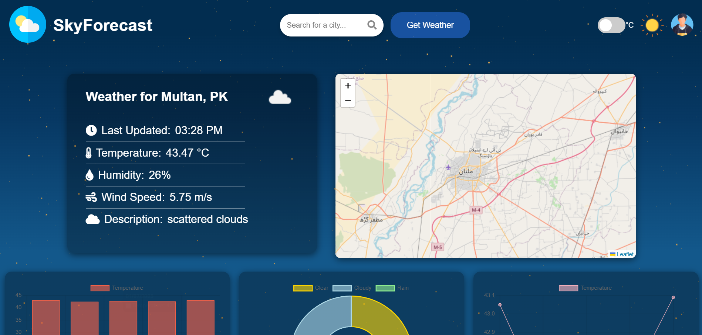
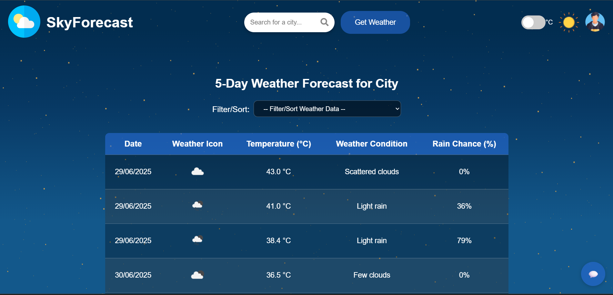

# 🌤️ SkyForecast Weather App

<div align="center">

**A modern, responsive weather application with AI-powered insights and interactive data visualization**

### Application Screenshots

<table>
<tr>
<td align="center">

<br/>
<b>Main Dashboard</b>
<br/>
<i>Interactive weather display with maps and charts</i>
</td>
<td align="center">

<br/>
<b>Detailed Forecast Table</b>
<br/>
<i>5-day weather forecast with advanced filtering</i>
</td>
</tr>
</table>

[](https://skyforecast-alpha.vercel.app/)
[](https://github.com/HassanRehman9393/Weather-website/stargazers)
[](https://github.com/HassanRehman9393/Weather-website/network/members)
[](https://github.com/HassanRehman9393/Weather-website/issues)
[](LICENSE.md)

</div>

---

## Table of Contents
- [Overview](#overview)
- [Features](#features)
- [Technologies Used](#technologies-used)
- [Live Demo](#live-demo)
- [Quick Start](#quick-start)
- [Detailed Usage Guide](#detailed-usage-guide)
- [Project Structure](#project-structure)
- [API Integration](#api-integration)
- [Customization](#customization)
- [Performance](#performance)
- [Troubleshooting](#troubleshooting)
- [Contributing](#contributing)
- [License](#license)
- [Acknowledgments](#acknowledgments)

## Overview

SkyForecast is a state-of-the-art weather application that combines modern web technologies with AI-powered insights to deliver comprehensive weather information. Featuring interactive maps, dynamic data visualization, and an intelligent chatbot, SkyForecast provides users with an engaging and informative weather experience across all devices.

## Live Demo

**[View Live Application](https://skyforecast-alpha.vercel.app/)**

Experience SkyForecast in action! The live demo showcases all features including real-time weather data, interactive maps, AI chatbot, and responsive design.

## Features

### Dynamic Weather Display
- **Current Weather**: Real-time weather information based on user's location or searched city
- **5-Day Forecast**: Detailed weather predictions for the upcoming 5 days
- **Hourly Forecast**: Breakdown of weather conditions at 5-hour intervals

### Interactive Map
- Powered by **Leaflet.js** for smooth navigation and location selection
- Automatic map centering based on searched location or user's current position
- Custom markers indicating weather conditions at different locations

### 📊 Data Visualization
- **Temperature Bar Chart**: Displays temperature trends over time
- **Weather Condition Doughnut Chart**: Shows distribution of different weather conditions
- **Temperature Line Chart**: Illustrates temperature variations across days

### Customizable User Interface
- **Theme Toggle**: Switch between dark and light themes for comfortable viewing
- **Temperature Unit Switch**: Easy toggle between Celsius and Fahrenheit
- **Responsive Design**: Seamless experience across desktop, tablet, and mobile devices

### Advanced Weather Table
- Comprehensive 5-day forecast with 5-hour interval data
- Advanced filtering and sorting options:
  - Ascending/Descending temperature order
  - Filter for rainy days
  - Highlight days with highest temperatures

### 🤖 AI-Powered Chatbot
- Integrated **Google Gemini** chatbot for natural language weather queries
- Provides weather-related advice and additional information
- Interactive conversational interface

## 🛠️ Technologies Used

<div align="center">

| Frontend | Mapping | Visualization | AI Integration |
|----------|---------|---------------|----------------|
|  |  |  |  |
|  | | | |
|  | | | |

</div>

**Core Technologies:**
- **Frontend**: HTML5, CSS3, JavaScript (ES6+)
- **Mapping**: Leaflet.js for interactive maps
- **Data Visualization**: Chart.js for dynamic charts
- **Icons**: Font Awesome for UI elements
- **AI Integration**: Google Gemini API
- **HTTP Client**: Fetch API for seamless data requests
- **Styling**: Custom CSS with Flexbox and Grid layouts
- **Deployment**: Vercel for hosting and CI/CD

## ⚡ Quick Start

### Prerequisites
- Modern web browser (Chrome, Firefox, Safari, Edge)
- Text editor or IDE (VS Code recommended)
- Internet connection for API requests

### Installation

1. **Clone the Repository**
   ```bash
   git clone https://github.com/HassanRehman9393/Weather-website.git
   cd Weather-website
   ```

2. **Install Dependencies** (Optional)
   ```bash
   npm install
   ```

3. **Configure API Keys**
   - Create a `config.js` file in the root directory
   - Add your API keys:
   ```javascript
   const CONFIG = {
     WEATHER_API_KEY: 'your_weather_api_key',
     GEMINI_API_KEY: 'your_gemini_api_key'
   };
   ```

4. **Launch the Application**
   - **Development**: Use Live Server extension in VS Code
   - **Production**: Deploy to your preferred hosting service
   - **Local**: Open `index.html` in your browser

### Live Deployment
The application is deployed and accessible at: **[https://skyforecast-alpha.vercel.app/](https://skyforecast-alpha.vercel.app/)**

## 📖 Detailed Usage Guide

### Current Weather
1. **Auto-detection**: Allow location access for automatic weather data
2. **Manual Search**: Use the search bar to enter any city name
3. **View Details**: Explore comprehensive current weather information

### Interactive Map
1. **Click to Explore**: Click on any location on the map to get weather data
2. **Auto-centering**: Map automatically centers on searched locations
3. **Visual Indicators**: Custom markers show weather conditions at different locations

### Data Visualization
1. **Chart Navigation**: Scroll down to view various interactive charts
2. **Detailed Information**: Hover over chart elements for specific data points
3. **Chart Controls**: Use available controls to zoom or pan through data

### Theme and Units
1. **Theme Toggle**: Click the sun/moon icon in the header to switch themes
2. **Temperature Units**: Use the temperature switch to toggle between °C and °F

### Advanced Forecast Table
1. **Access Table**: Navigate to the detailed table view
2. **Filter Options**: Use dropdown filters to customize data display:
   - Ascending/Descending temperature sorting
   - Show only rainy days
   - Display highest temperature days

### AI Chatbot
1. **Open Chat**: Click the chat icon to access the AI assistant
2. **Natural Queries**: Type weather-related questions in natural language
3. **Get Insights**: Receive AI-generated responses and weather advice

## 📁 Project Structure

```
SkyForecast/
┣ index.html                 # Main application entry point
┣ README.md                  # Project documentation
┣ package.json               # Project dependencies and scripts
┣ stylesheets/               # CSS styling files
┃ ┣ style.css               # Main application styles
┃ ┣ stars.css               # Background star animation
┃ ┣ sidebar.css             # Navigation sidebar styles
┃ ┣ charts.css              # Chart visualization styles
┃ ┣ table.css               # Weather table styles
┃ ┗ chatbot.css             # AI chatbot interface styles
┣ scripts/                   # JavaScript functionality
┃ ┣ index.js                # Core application logic
┃ ┗ chatbot.js              # AI chatbot implementation
┣ images/                    # UI assets and icons
┃ ┣ image.png               # Main logo/hero image
┃ ┣ user.png                # User profile icon
┃ ┣ sun.png                 # Light theme icon
┃ ┣ moon.png                # Dark theme icon
┃ ┣ celsius.png             # Celsius unit icon
┃ ┣ fahrenheit.png          # Fahrenheit unit icon
┃ ┣ kelvin.png              # Kelvin unit icon
┃ ┣ comment.png             # Chat/comment icon
┃ ┗ profile.png             # Profile image
┗ config.js                  # API configuration (not in repo)
```

## 🔌 API Integration

SkyForecast seamlessly integrates with multiple APIs to provide comprehensive weather data and AI functionality:

### Weather Data API
- **Provider**: OpenWeatherMap / WeatherAPI (configurable)
- **Endpoints**:
  - Current weather conditions
  - 5-day weather forecast
  - Geocoding for location search
  - Reverse geocoding for map clicks

### Google Gemini AI API
- **Purpose**: Natural language processing for the chatbot
- **Capabilities**:
  - Weather-related query processing
  - Intelligent response generation
  - Context-aware weather advice
  - Multi-turn conversation support

## 🎨 Customization

SkyForecast is designed to be easily customizable to match your preferences:

### Themes
- **Location**: `stylesheets/style.css`
- **Options**: Modify CSS variables for color schemes
- **Custom Themes**: Create new theme variations

### Charts & Visualizations
- **Location**: `scripts/index.js`
- **Options**: Customize Chart.js configurations
- **Features**: Colors, animations, data display options

### Icons & Assets
- **Location**: `images/` directory
- **Options**: Replace or add new weather icons
- **Formats**: PNG, SVG supported

## ⚡ Performance

SkyForecast is optimized for speed and efficiency:

- **Lazy Loading**: Images and non-critical CSS loaded on demand
- **Minification**: Compressed CSS and JavaScript for production
- **Efficient Data Structures**: Optimized handling of large datasets
- **Smart Caching**: Reduced API calls through intelligent data caching
- **Mobile Optimization**: Responsive design for all device types

## 🐛 Troubleshooting

### Common Issues & Solutions

| Issue | Solution |
|-------|----------|
| Weather data not loading | Verify API key configuration and network connectivity |
| Map not displaying | Ensure Leaflet.js library is properly loaded |
| Chatbot not responding | Check Google Gemini API integration and key validity |
| Mobile layout issues | Clear browser cache and check viewport settings |
| Charts not rendering | Verify Chart.js library and check console for errors |


## 🤝 Contributing

We welcome contributions from the community! Here's how you can help make SkyForecast even better:

### How to Contribute

1. **Fork** the repository
2. **Create** your feature branch
   ```bash
   git checkout -b feature/AmazingFeature
   ```
3. **Commit** your changes
   ```bash
   git commit -m 'Add some AmazingFeature'
   ```
4. **Push** to the branch
   ```bash
   git push origin feature/AmazingFeature
   ```
5. **Open** a Pull Request

### Ways to Contribute
- Report bugs and issues
- Suggest new features
- Improve documentation
- Enhance UI/UX design
- Optimize performance
- Add internationalization

### Guidelines
- Follow existing code style and conventions
- Write clear commit messages
- Test your changes thoroughly
- Update documentation when needed

## 📄 License

This project is licensed under the **MIT License** - see the [LICENSE.md](LICENSE.md) file for details.

## 🙏 Acknowledgments

Special thanks to the amazing open-source community and the following:

- **Weather Data**: Powered by reliable weather APIs
- **Mapping**: [Leaflet.js](https://leafletjs.com/) for interactive maps
- **Visualizations**: [Chart.js](https://www.chartjs.org/) for beautiful charts
- **Icons**: [Font Awesome](https://fontawesome.com/) for UI elements
- **AI Integration**: [Google Gemini API](https://ai.google.dev/) for intelligent chatbot
- **Deployment**: [Vercel](https://vercel.com/) for seamless hosting
- **Contributors**: All the amazing developers who contributed to this project

---

<div align="center">

**If you found this project helpful, please give it a star on GitHub!**

</div>
